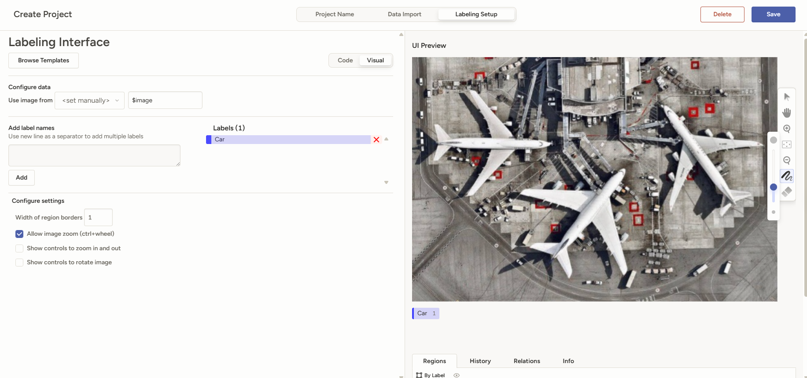

# 1021H

Group 1021H

# Tools

## Label Studio

https://github.com/HumanSignal/label-studio?tab=readme-ov-file#try-out-label-studio

## Labeling Setup

1. Create a new project
2. Import the `label_data.json` (found in `segmentation/label_data.json`)
3. On Labeling Setup tab: Browse Template > Computer Vision > Semantic Segmentation with Masks
4. Delete `airplan` and `Save`

